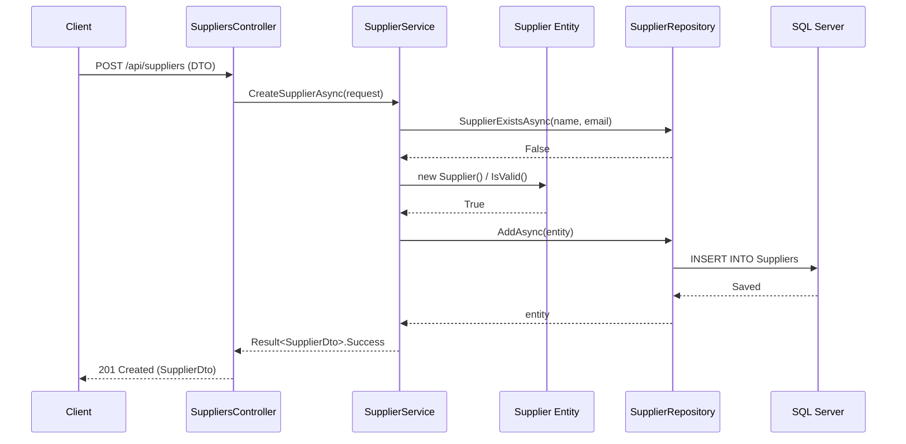

# CreateSupplier Workflow Analysis

This document provides a detailed analysis of the **CreateSupplier** API flow design patterns, strengths, and recommended improvements.

## 1. Request Life Cycle Flow
The flow of a `CreateSupplier` request follows a structured path through the layers:

1.  **API Layer** (`SuppliersController`): Receives the `CreateSupplierRequest` DTO.
2.  **Application Layer** (`SupplierService`): Handles business logic, validation, and coordination.
3.  **Domain Layer** (`Supplier` entity): Enforces business rules and manages state.
4.  **Infrastructure Layer** (`SupplierRepository`): Performs data persistence using Entity Framework Core.
5.  **Response**: A `Result<SupplierDto>` is bubbled back up, which the Controller translates into an HTTP response (`201 Created` or Error).

---

## 2. Design Patterns Used

| Pattern | Implementation in CreateSupplier |
| :--- | :--- |
| **Layered Architecture** | Strict separation between API, Application, Domain, and Infrastructure layers. |
| **Dependency Injection** | Constructors in Controllers and Services inject interfaces (`ISupplierService`, `ISupplierRepository`). |
| **Repository Pattern** | `SupplierRepository` abstracts the database logic, inheriting from a `GenericRepository<Supplier>`. |
| **Result Pattern** | Use of a custom `Result<T>` object to return status, data, and errors instead of throwing exceptions for logic flow. |
| **DTO (Data Transfer Object)** | `CreateSupplierRequest` and `SupplierDto` decouple the API contract from the internal database schema. |
| **Rich Domain Model** | The `Supplier` entity contains its own logic (`Update`, `Activate`, `ToggleStatus`, `IsValid`) rather than being a simple data holder. |
| **Multi-Tenancy** | Inherits from `TenantEntity`, ensuring data isolation across different clients automatically. |
| **Structured Logging** | Comprehensive logging via `ILogger` with placeholders for auditability. |

---

## 3. "Best Things" (Strengths)

1.  **Robust Error Handling**: The Result Pattern ensures the API always returns a predictable structure, making it very "frontend-friendly."
2.  **Logic Encapsulation**: Business rules (like `IsValid()` and `Update()`) are inside the entity. This prevents "Anemic Domain Model" and makes the code reusable.
3.  **Traceability**: The service is heavily instrumented with logs, making it easy to debug production issues by following the logic flow.
4.  **Data Isolation**: Clean usage of `TenantEntity` ensures that even a simple "Create" operation is safe within the multi-tenant context.
5.  **Clean Separation**: The Controller is extremely "thin." It only handles HTTP concerns (ModelState, StatusCodes) while the Service handles the heavy lifting.

---

## 4. Recommended Improvements

| Area | Suggestion | Why? |
| :--- | :--- | :--- |
| **Validation** | Use **FluentValidation** instead of `ValidationContext` in the service. | It's more expressive, separates validation from the service, and provides better support for complex rules. |
| **Mapping** | Use **AutoMapper** instead of manual `MapToDto` methods. | The project already has AutoMapper configured. Using it consistently reduces boilerplate code and human error. |
| **Pattern** | Introduce **CQRS (with MediatR)**. | As `SupplierService` grows (it currently has 12+ methods), it becomes a "God Object." Decoupling commands (Create) from queries (GetStats) improves maintainability. |
| **Entity Creation** | Use the static `Supplier.Create()` factory method in the service. | Currently, the service uses `new Supplier { ... }`. Using the factory ensures that the Domain's constructor requirements are always respected. |
| **Uniformity** | Standardize `DateTime.UtcNow` consumption. | Some parts use `DateTime.Now` (Service) while the entity uses `DateTime.UtcNow`. Using `UtcNow` everywhere is best practice for cloud applications. |

---

## 5. Visualizing the Pattern

